#   

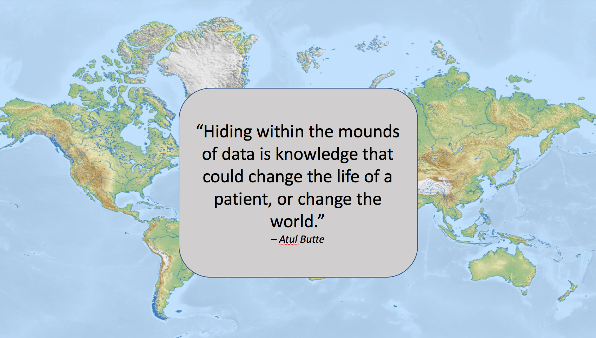

---
#   

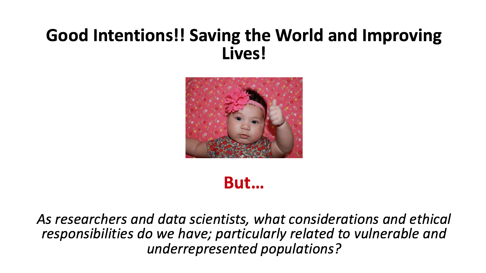

---
#  87 Million 

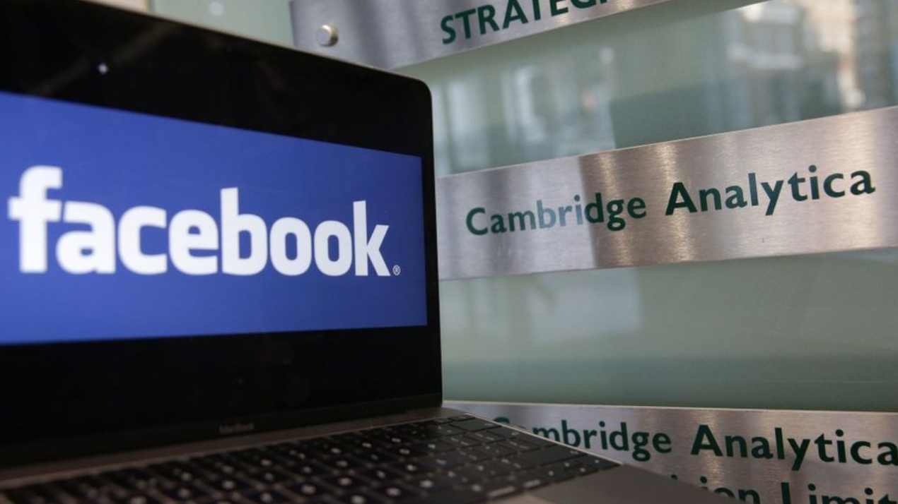

---
#  17.6 Million 

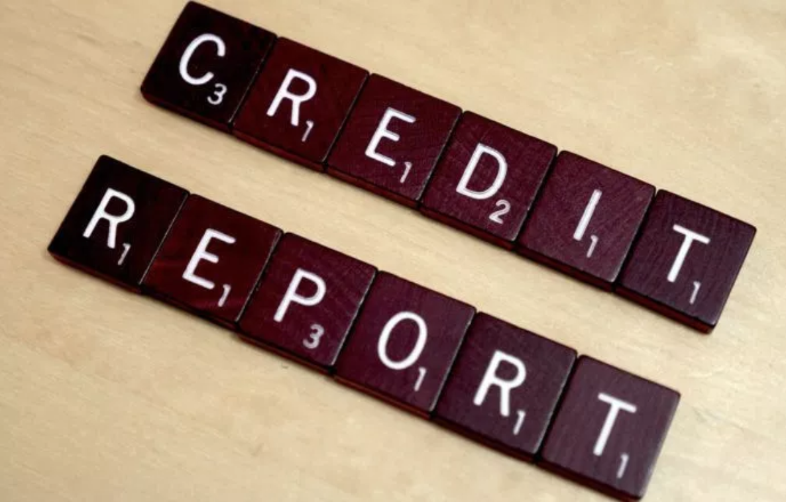

---
#   

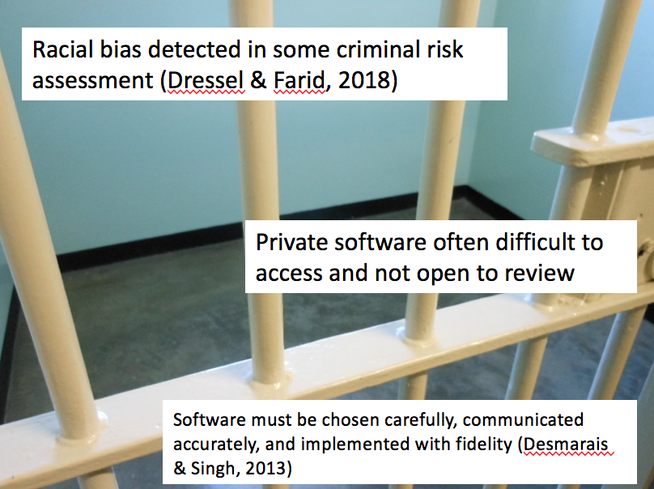

---
#  Predictive Analytics in Child Welfare? (Hurley, 2018) 

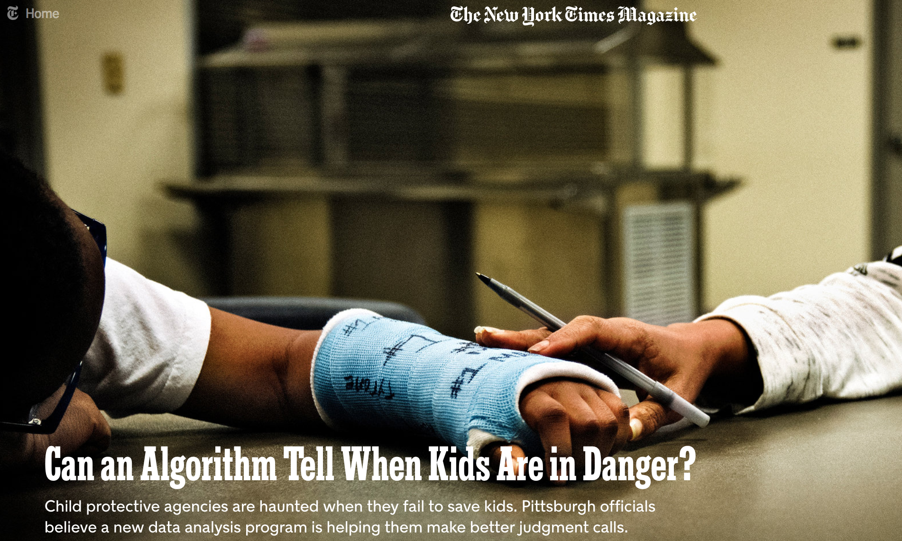

---
#  Data Protection Policies Not Keeping Pace 

+ Varied and often contradictory federal, state, and agency specific policies
+ IRBs updating but still not comprehensive
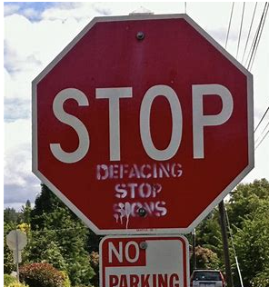

---
#  Systematic Scoping Review on Big Data Use 🛠 Methods & Tools 

+ Mixed Methods
+ Qualitative Content Analysis
+ Prisma Scoping Review Guidelines ( Prisma-ScR  coming soon)

---
#   

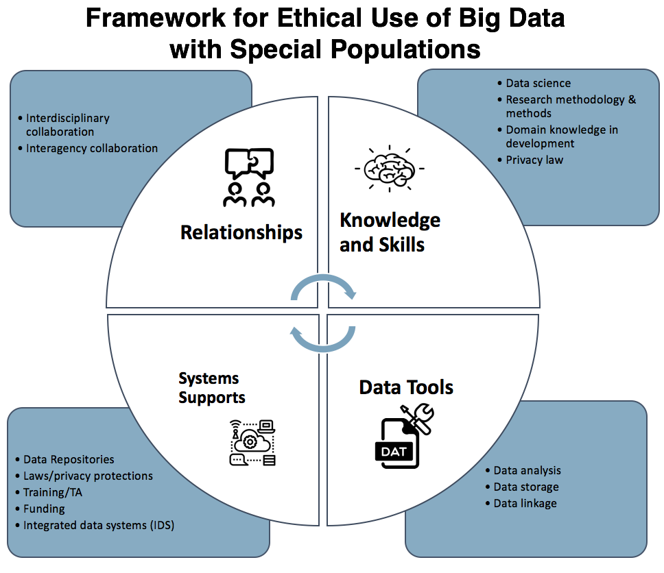

---
#  What Can We Do as Researchers and Data Scientists? 

+ ***Collaborate*** to gain domain knowledge in area of analysis to ensure accuracy of findings and decrease harm to potentially sensitive groups that may be under-represented
+ ***Utilize mixed methods*** **** with large scale data to improve accuracy of findings and ensure underrepresented groups have voice
+ Engage in ***Training*** **** in data ethics
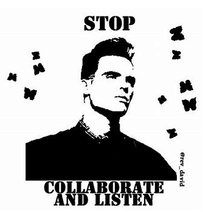

---
#  What Can We Do as Researchers and Data Scientists?  

+ ***Promote policies*** for data ethics that include considerations and biases related to vulnerable and underrepresented populations
+ Advocate for a ***balance of data access and data privacy*** ** to ensure protection while also avoiding exposing more subject groups and vulnerable populations
+ Continue to ***encourage diversity*** in the field of data science and research

---
#  What Can We Do as Researchers and Data Scientists? 

**Take Time to Reflect!**
+ Who is missing?
+ What are the potential biases?
+ What are the potential impacts of assumptions and findings?
+ Who should I be collaborating with to ensure the domain knowledge to answer the prior questions?
+ How could this be misinterpreted? How do I help to communicate and advocate for appropriate use?

---
#  What’s Next?? 

+ Develop ***ethical standards*** for reporting of big data use in research (e.g. consistent reporting of data linkage rates)
+ Need for ***ethical guidelines*** in the field of data science – contribute your expertise!
+ Include data ethics in training for data scientists ***with particular attention to special populations***
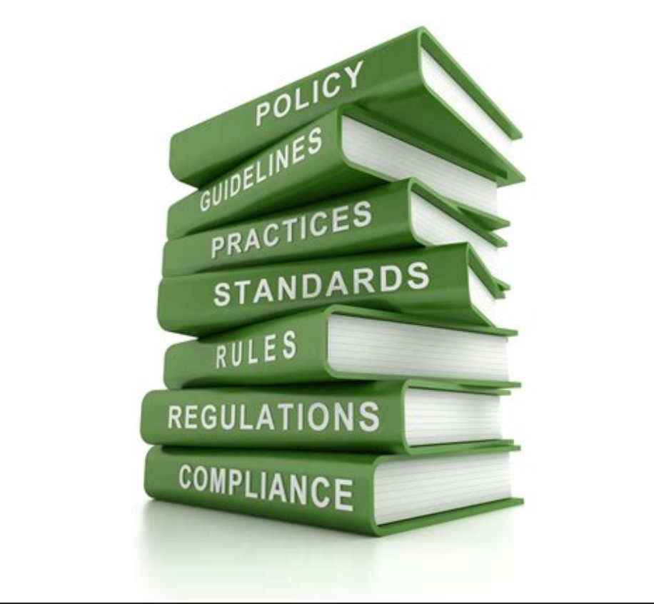

---
#   

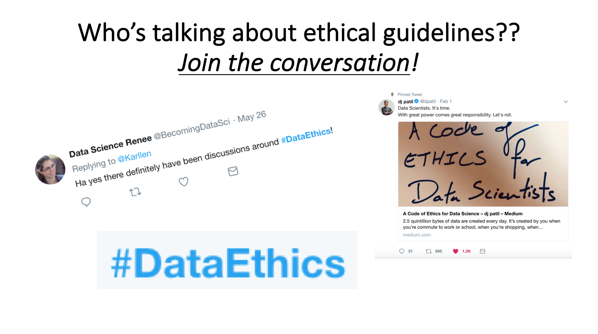

---
#  Special Thanks to @datalorax for Slidex! 

[https](https://github.com/datalorax/slidex)
[://github.com/datalorax/slidex](https://github.com/datalorax/slidex)
